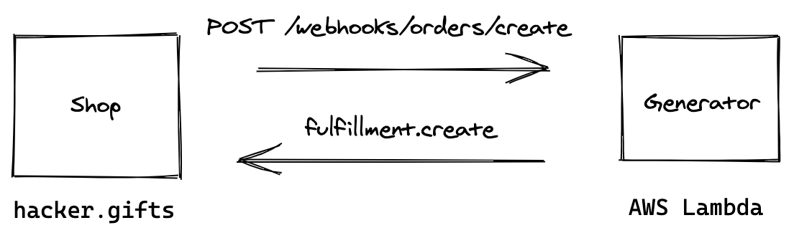

# 回到 Rails


翻译自：[Moving my serverless project to Ruby on Rails / frantic.im](https://frantic.im/back-to-rails)


我有一个小项目：[digital gift cards for hackers](https://hacker.gifts/)。它使用 Shopify 处理所有和商店有关的东西：前台、支付、退款，报表，等等。


但与标准的数字产品不同（电子书，视频），我想用户从商店支付的每个卡片，都是唯一的。所以我写了个脚本，生成个人化的图片，并为每一个订单手动运行它。


接下来想要将这个过程自动化。一开始，我构建了一个 `serverless` AWS Lambda。此时这门技术正大热，我正想学习。在我的使用场景下，它看起来非常适合：每次都运行这个函数，而且服务端需求。





开始项目非常容易。我构建了相应的 JavaScript 方法并部署到 `AWS` Lambda 上，并增加 `Shopify` web 回调，一切都工作的很好！


总结下使用 `serverless` 模式开发中获得的好处（针对业余项目）：

- 项目开始简单
- 不需要配置服务器
- 自由加载


实际上，编写 Lambda 函数的工作，只占了总工作的 10%。


随着时间推移，我的需求变得复杂：我需要存储每个商品的状态，发送确认邮件，并展示详情页面。解决方案由一个简单的方法，增长为一系列 serverless 方法，SNS 主题，S3 存储，动态数据表。这些内容由 YAML 组合再一起，传递 serverless 的 JSON 对象，以及 AWS 控制台中，以硬编码组合在一起。


我想这是个典型的软件开发流程：项目由简单变为一团乱麻，然后需要一些重构。首先使其运行（验证市场需求），然后使其正确（变得更好）。


但这次有点不不一样。我不想像过去一样，只是简单的重构他们。下面使原因：


```
当构建的内容（代码块）过于简单时，复杂性就会转移到各个块的交互中。
```


serverless 代码块之间的交互发生在我的应用程序之外。一个 `lambda` 像 SNS 发布一条信息，另外一个获取它，并将其写入 DynamoDB，第三个 `lambda` 块生成一条新记录，并发送邮件。


我也许单独测试这个流程中每个单独的块，但我不太信任这套流程。如果发布失败，我如何知道？系统将如何恢复？我可以回滚吗？日志如何处理呢？


